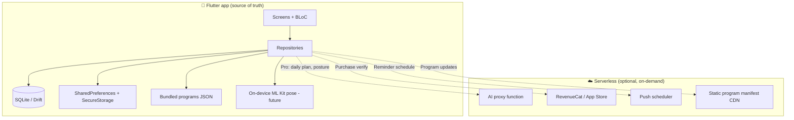

# CalmCalibrate — Backend & Local Data Spec (Serverless + Local-First)

> **Status:** Frontend prototype is ~95% complete. Data layer is mock/local only.  
> **Goal:** Ship without a traditional always-on backend. Store user data on-device; use serverless only where the phone cannot do the work.

**Related docs**

| Doc | Purpose |
|-----|---------|
| [codebase-guide.md](./codebase-guide.md) | Routes, BLoCs, widgets, data flow |
| [product-and-backend-spec.md](./product-and-backend-spec.md) | Full feature spec + production API ideas |
| [user-journey-day1-30.md](./user-journey-day1-30.md) | Engagement rules |

---

## 1. What we built (frontend recap)

### Done on the client

| Area | Status | Notes |
|------|--------|-------|
| Onboarding (pain, work pattern, goals, assessment) | ✅ | 4-step shell + assessment BLoC |
| Main tabs (Home, Progress, Sessions, Profile) | ✅ | Bottom nav shell |
| Workout flow (pre-check-in → active → complete) | ✅ | Workout BLoC + timer |
| 30-day journey + milestones + check-in | ✅ | EngagementRepository rules |
| Premium / paywall / Pro gates | ✅ UI | Trial is local mock |
| AI sections (daily plan, posture, weekly insight) | ✅ UI | AiService returns mock data |
| Dark mode + responsive layout | ✅ | AppCache.themeMode |
| Design system + animations | ✅ | `core/widgets/` |
| Local persistence | ✅ Basic | Single JSON blob in SharedPreferences |

### Current data stack

```
UI → BLoC → Repository → AppCache → SharedPreferences (one JSON file)
                              ↓
                    Session catalog hard-coded in Dart
                    AiService mock (optional OPENAI_API_KEY hook, unused)
```

**Files to know:**

| File | Role |
|------|------|
| `lib/data/local/app_state.dart` | All fields in one object |
| `lib/data/local/app_cache.dart` | Load/save, day rollover, streaks |
| `lib/data/local/local_storage.dart` | SharedPreferences wrapper |
| `lib/data/repositories/*` | User, Session, Engagement, Subscription |
| `lib/data/services/ai_service.dart` | Mock AI |
| `lib/data/repositories/session_repository.dart` | Static exercise programs |

### Not built yet

- Real camera / ML posture scan  
- Real payments (RevenueCat / StoreKit)  
- Push notifications (FCM / APNs)  
- Cloud backup or multi-device sync  
- Remote session CMS  
- Structured local DB (SQLite)  
- Serverless AI proxy  

---

## 2. Recommendation for this app

### Verdict: **Local-first + serverless edge functions**

CalmCalibrate is a **personal wellness / habit app**. Most data is private, generated on-device, and used offline during desk breaks. You do **not** need PostgreSQL + REST API + auth server for v1.

| Approach | Fit for CalmCalibrate |
|----------|----------------------|
| **Traditional backend** (Node + Postgres) | Overkill for MVP; ongoing cost; privacy friction |
| **Local-only (SQLite + bundled content)** | ✅ Best default — fast, offline, private |
| **Serverless functions** | ✅ Only for AI, webhooks, optional backup |
| **BaaS** (Supabase / Firebase) | ✅ Good if you want auth + backup later without managing servers |

### SQLite vs SharedPreferences vs “cache”

| Storage | Use for | Avoid for |
|---------|---------|-----------|
| **SQLite** (recommended: **Drift**) | Profile, session logs, check-ins, posture history, journey state, cached AI plans | — |
| **SharedPreferences** | Theme mode, last app version, small flags | Growing lists (session logs!) |
| **Secure storage** | RevenueCat user id, optional auth token | Large data |
| **In-memory cache** | Session catalog, computed weekly stats | Persistence |
| **Bundled assets / JSON** | Exercise programs, soundscape metadata | User-specific data |

**Why move off the current JSON blob?**

1. `sessionLogs` grows every workout — JSON rewrite gets slow  
2. Progress charts need **queries** (date ranges, aggregates)  
3. SQLite supports **migrations** as schema evolves  
4. Easier to add indexes for “sessions this week”  

**Suggested stack (Flutter)**

```yaml
dependencies:
  drift: ^2.x                  # SQLite ORM + migrations
  sqlite3_flutter_libs: ^0.x
  flutter_secure_storage: ^9.x
  shared_preferences: ^2.x     # keep for tiny prefs
  purchases_flutter: ^8.x        # RevenueCat (when ready)
```

**Suggested serverless (pick one platform)**

| Platform | Good for |
|----------|----------|
| **Supabase Edge Functions** | AI proxy + optional Postgres backup |
| **Firebase Cloud Functions** | FCM push + AI proxy |
| **Cloudflare Workers** | Cheap AI proxy, static CMS JSON |

---

## 3. Architecture target



**Principles**

1. **Device owns user data** — works on a plane, no account required for free tier  
2. **No raw video leaves device** — posture = on-device landmarks → scores only  
3. **AI calls go through one serverless proxy** — API key never in the app binary  
4. **Subscriptions via RevenueCat** — Apple/Google are source of truth; app stores entitlement locally  
5. **Cloud backup is opt-in Pro** — not required for launch  

---

## 4. SQLite schema

Maps 1:1 from current `AppState` + models. Use Drift table classes; names below are logical.

### 4.1 Core tables

#### `user_profile` (single row, id = 1)

| Column | Type | Source today |
|--------|------|--------------|
| id | INTEGER PK | always 1 |
| name | TEXT | `UserProfile.name` |
| sitting_hours | TEXT | enum name |
| goal | TEXT | enum name |
| reminder_minutes | INTEGER | default 45 |
| smart_reminders | INTEGER (bool) | |
| onboarding_complete | INTEGER (bool) | |
| streak_days | INTEGER | |
| mobility_points | INTEGER | |
| is_premium | INTEGER (bool) | synced from RevenueCat |
| created_at | TEXT ISO | new |
| updated_at | TEXT ISO | new |

#### `user_pain_areas`

| Column | Type |
|--------|------|
| area | TEXT PK | `neck`, `back`, … |
| selected_at | TEXT ISO |

#### `user_break_times`

| Column | Type |
|--------|------|
| break_time | TEXT PK | `morning`, `midday`, … |

---

#### `mobility_assessments`

| Column | Type |
|--------|------|
| id | TEXT PK (uuid) |
| overall | INTEGER | 0–100 |
| source | TEXT | `onboarding_mock`, `on_device_ml`, `manual` |
| captured_at | TEXT ISO |

#### `mobility_area_scores`

| Column | Type |
|--------|------|
| assessment_id | TEXT FK |
| area | TEXT |
| score | INTEGER |
| potential_gain | INTEGER |

---

#### `session_logs`

| Column | Type | Source |
|--------|------|--------|
| id | TEXT PK (uuid) | new |
| session_id | TEXT | `morning_reset`, etc. |
| completed_at | TEXT ISO | |
| duration_minutes | INTEGER | |
| pre_pain_score | INTEGER | 1–5 |
| post_pain_score | INTEGER | 1–5 |
| mobility_points_earned | INTEGER | |
| mood | TEXT nullable | Pro |

**Index:** `(completed_at DESC)`, `(session_id)`

---

#### `journey_state` (single row)

| Column | Type | Source |
|--------|------|--------|
| id | INTEGER PK | 1 |
| current_day | INTEGER | 1–30 |
| program_start_date | TEXT ISO | |
| last_active_date | TEXT ISO | |
| last_check_in_date | TEXT ISO | |
| checked_in_today | INTEGER (bool) | reset at midnight |
| pre_pain_score | INTEGER | today’s check-in |

#### `journey_day_completions`

| Column | Type |
|--------|------|
| day | INTEGER PK |
| completed_at | TEXT ISO |

#### `daily_session_completions`

| Column | Type |
|--------|------|
| date | TEXT PK | `YYYY-MM-DD` |
| session_id | TEXT PK |

---

#### `achievements`

| Column | Type |
|--------|------|
| achievement_id | TEXT PK | `first_break`, `streak_3`, … |
| unlocked_at | TEXT ISO |

#### `seen_milestones`

| Column | Type |
|--------|------|
| day | INTEGER PK | 3, 7, 14, 30 |
| seen_at | TEXT ISO |

---

#### `posture_analyses`

| Column | Type |
|--------|------|
| id | TEXT PK |
| score | INTEGER |
| summary | TEXT |
| recommendations_json | TEXT | JSON array |
| desk_tips_json | TEXT | JSON array |
| selected_issues_json | TEXT | JSON array |
| analyzed_at | TEXT ISO |

---

#### `ai_daily_plans`

| Column | Type |
|--------|------|
| date | TEXT PK | `YYYY-MM-DD` |
| morning | TEXT |
| midday | TEXT |
| evening | TEXT |
| coach_note | TEXT |
| generated_at | TEXT ISO |
| source | TEXT | `local_mock`, `serverless_llm` |

---

#### `app_preferences` (single row)

| Column | Type |
|--------|------|
| theme_mode | TEXT | `system`, `light`, `dark` |
| mood_sound_enabled | INTEGER (bool) |
| workout_mood | TEXT nullable |

---

#### `subscription_state` (single row)

| Column | Type |
|--------|------|
| plan | TEXT nullable | `monthly`, `yearly` |
| premium_since | TEXT ISO nullable |
| revenuecat_customer_id | TEXT nullable |
| expires_at | TEXT ISO nullable |

> Store sensitive IDs in **flutter_secure_storage**; mirror entitlement flags in SQLite for fast reads.

---

### 4.2 Content tables (catalog — seed from bundled JSON)

#### `exercise_programs`

| Column | Type |
|--------|------|
| id | TEXT PK |
| title | TEXT |
| subtitle | TEXT |
| duration_minutes | INTEGER |
| icon | TEXT |
| is_premium | INTEGER (bool) |
| sort_order | INTEGER |
| version | INTEGER | bump when CMS updates |

#### `exercise_steps`

| Column | Type |
|--------|------|
| id | TEXT PK |
| program_id | TEXT FK |
| step_index | INTEGER |
| name | TEXT |
| duration_seconds | INTEGER |
| instruction | TEXT |
| pose | TEXT | enum name |
| tip | TEXT |

#### `program_focus_areas`

| Column | Type |
|--------|------|
| program_id | TEXT |
| area | TEXT |

**Seed strategy:** Ship v1 programs as `assets/data/programs.json` → import into SQLite on first launch. Later, serverless/CDN serves manifest diff for updates.

---

## 5. Serverless functions (minimal set)

Only call the cloud when necessary.

### 5.1 Required for Pro launch

| Function | Trigger | Input | Output |
|----------|---------|-------|----------|
| `POST /ai/daily-plan` | User taps Generate | `{ painAreas, mobilityScore, recentSessions[], date }` | `AiDailyPlan` JSON |
| `POST /ai/posture/analyze` | Check-in analyze | `{ issues[], mobilityScore, painAreas }` | `PostureAnalysis` JSON |
| `POST /ai/weekly-insight` | Progress / recap | `{ sessionCount, minutes, avgRelief, score }` | `{ insight }` |

**Rules**

- API key lives in function env (`OPENAI_API_KEY`)  
- Rate limit: 10 AI calls / user / day (use device id + optional account)  
- Cache response in SQLite (`ai_daily_plans`) — one plan per calendar day  
- Fallback to local mock if offline  

### 5.2 Subscriptions (not custom serverless)

Use **RevenueCat** SDK — no custom payment backend.

```
App → purchases_flutter → RevenueCat → App Store / Play Store
     → entitlement listener → subscription_state table
```

### 5.3 Optional (post-MVP)

| Function | Purpose |
|----------|---------|
| `GET /content/programs/manifest` | Version + download URL for program JSON |
| `POST /backup/export` | Pro: encrypted backup blob |
| `POST /backup/restore` | Pro: restore on new device |
| Scheduled FCM | Smart break reminders |

---

## 6. Repository changes (Flutter)

Keep the same repository interfaces — swap implementations.

| Repository | Today | Target |
|------------|-------|--------|
| `UserRepository` | AppCache JSON | Drift DAO |
| `SessionRepository` | Static Dart list | SQLite catalog + cache |
| `EngagementRepository` | AppCache + rules | Drift journey tables |
| `SubscriptionRepository` | AppCache mock | RevenueCat + Drift |
| `AiService` | Mock delay | Local mock + serverless HTTP |

**Migration path**

```
Phase A: Add Drift alongside AppCache
Phase B: On launch, if AppCache JSON exists → import to SQLite once
Phase C: Repositories read/write Drift only
Phase D: Remove AppState JSON blob (keep SharedPreferences for flags only)
```

---

## 7. Privacy & security

| Data | Stays on device | Can sync (opt-in) |
|------|-----------------|-------------------|
| Session logs, pain scores | ✅ | Pro backup only |
| Camera / pose frames | ✅ never upload | ❌ |
| Posture scores + issues | ✅ | Optional |
| AI prompts (aggregated context) | Sent to LLM proxy | No PII required |
| Name | ✅ | Optional |
| Payment info | ❌ (Store handles) | RevenueCat id only |

---

## 8. Implementation phases

### Phase 1 — Local DB (no server) — **start here**

- [ ] Add Drift + define tables above  
- [ ] Migration import from `AppCache` JSON  
- [ ] Refactor repositories to use DAOs  
- [ ] Move session catalog to `assets/data/programs.json` → seed SQLite  
- [ ] Remove debug `auth-check` prints when done testing  

**Outcome:** App works fully offline with proper persistence.

### Phase 2 — Real subscriptions

- [ ] RevenueCat project + products  
- [ ] Replace mock `activatePremium()` with purchase flow  
- [ ] Entitlement listener → `subscription_state`  

### Phase 3 — Serverless AI

- [ ] One edge function (Supabase / Firebase / Cloudflare)  
- [ ] `AiService` calls HTTP when online + Pro; falls back to mock  
- [ ] Cache in `ai_daily_plans` table  

### Phase 4 — On-device posture (no server)

- [ ] `camera` + ML Kit pose detection  
- [ ] Compute metrics → `mobility_assessments`  
- [ ] Replace assessment mock in `AssessmentBloc`  

### Phase 5 — Optional cloud

- [ ] Auth (Apple Sign In) + encrypted backup  
- [ ] FCM smart reminders  
- [ ] CMS program updates via CDN manifest  

---

## 9. API contract sketch (serverless AI proxy)

Single base URL, e.g. `https://api.calmcalibrate.app/v1` or Supabase function URL.

### `POST /ai/daily-plan`

**Request**

```json
{
  "date": "2026-06-13",
  "profile": {
    "painAreas": ["neck", "lowerBack"],
    "sittingHours": "sixToEight",
    "goal": "reducePain",
    "streakDays": 5
  },
  "mobilityScore": 62,
  "recentSessions": [
    { "sessionId": "morning_reset", "postPainScore": 2, "completedAt": "..." }
  ],
  "latestPosture": { "score": 58, "issues": ["Forward head"] }
}
```

**Response**

```json
{
  "date": "2026-06-13",
  "morning": "Start with neck rolls...",
  "midday": "Focus on hip flexor release...",
  "evening": "Wind down with thoracic opener...",
  "coachNote": "Your streak is strong — keep midday breaks consistent."
}
```

### `POST /ai/posture/analyze`

**Request**

```json
{
  "selectedIssues": ["Forward head", "Rounded shoulders"],
  "mobilityScore": 62,
  "painAreas": ["neck"],
  "sittingHours": "sixToEight",
  "recentSessionCount": 4
}
```

**Response**

```json
{
  "score": 54,
  "summary": "...",
  "recommendations": ["..."],
  "deskTips": ["..."]
}
```

---

## 10. Decision summary

| Question | Answer |
|----------|--------|
| Traditional backend? | **No** for v1 |
| Serverless? | **Yes** — AI proxy only (+ optional backup later) |
| SQLite or SharedPreferences? | **SQLite (Drift)** for user data; prefs for tiny settings |
| Where is source of truth? | **Phone** |
| When to add cloud? | Subscriptions (RevenueCat), AI (edge function), backup (optional Pro) |

---

## 11. Next coding task

1. Add `drift` + `database.dart` with tables from §4  
2. Write `AppCacheMigrator` — import existing SharedPreferences JSON once  
3. Point `MockUserRepository` → `DriftUserRepository`  
4. Extract programs from `session_repository.dart` → `assets/data/programs.json`  

See [folder-structure.md](./folder-structure.md) for where new files go:

```
lib/data/local/database.dart       # Drift schema
lib/data/local/daos/               # profile_dao, session_log_dao, …
lib/data/local/migrations/         # v1, import from AppCache
assets/data/programs.json          # exercise catalog seed
```

---

*Last updated: aligns with current AppState, repositories, and frontend-complete prototype.*
