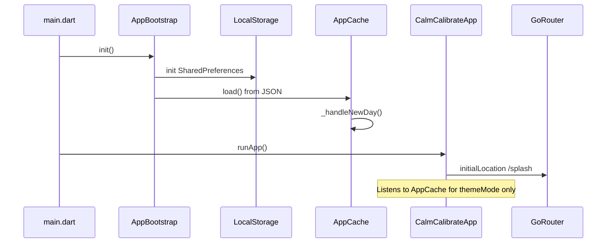
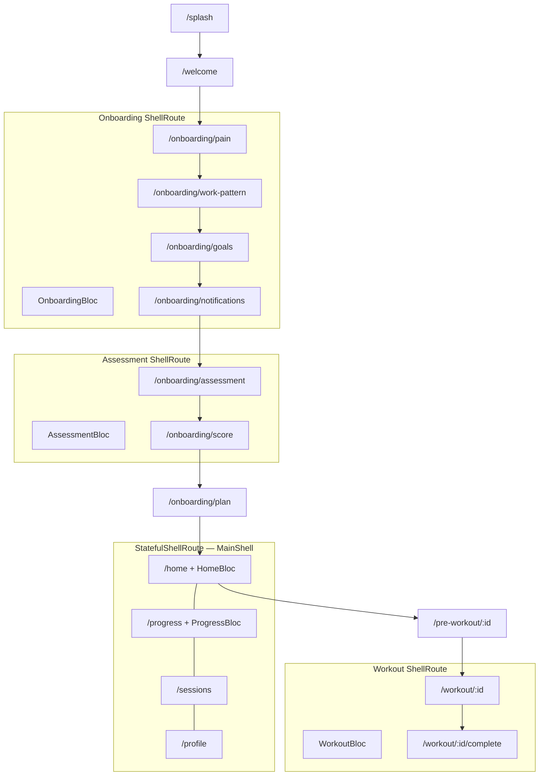
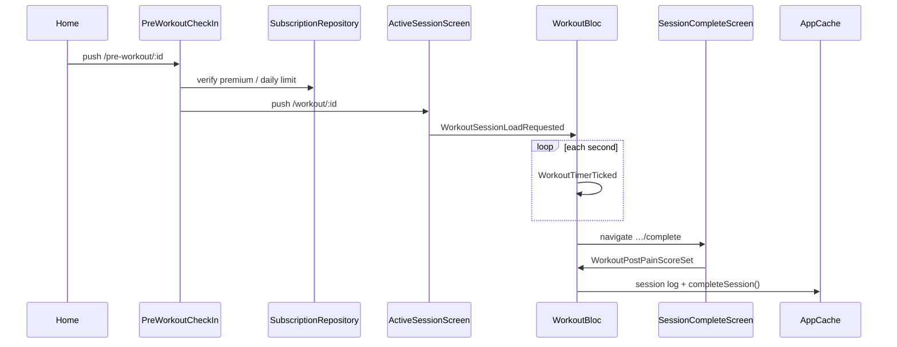

# CalmCalibrate — Complete codebase guide

One document for how the app is wired: startup, routes, screens, BLoCs, widgets, data, and end-to-end flows.

**Related docs**

| Doc | What it covers |
|-----|----------------|
| [architecture-guide.md](./architecture-guide.md) | Layer model, BLoC pattern, glossary |
| [folder-structure.md](./folder-structure.md) | Where to put new files, import rules |
| [frontend-structure.md](./frontend-structure.md) | Design system, animations, screen inventory |
| [user-journey-day1-30.md](./user-journey-day1-30.md) | Product journey and engagement rules |

---

## 1. How to read this codebase

**Start here when debugging a feature:**

1. Find the **route** in `lib/app/router.dart` → which **screen** and which **BlocProvider** (if any).
2. Open the **screen** in `lib/presentation/screens/` → see `BlocBuilder` / `context.read<Bloc>().add(...)`.
3. Open the matching **bloc** in `lib/presentation/blocs/<feature>/` → events trigger handlers that call **repositories**.
4. Repositories read/write **`AppCache.instance`** → persisted as one JSON blob via **`LocalStorage`** (SharedPreferences).

**Golden rule:** UI sends **events** to BLoC. BLoC uses repositories. Repositories touch `AppCache`. UI never calls SharedPreferences directly.

---

## 2. App startup



| File | Role |
|------|------|
| `lib/main.dart` | `WidgetsFlutterBinding`, `AppBootstrap.init()`, `runApp(CalmCalibrateApp)` |
| `lib/app/bootstrap.dart` | Loads `LocalStorage` then `AppCache.instance.load()` |
| `lib/app/app.dart` | `MaterialApp.router`, light/dark theme, text-scale clamp, theme from cache |
| `lib/app/router.dart` | All routes, shell BLoC providers, bottom tabs |

**Splash routing** (`splash_screen.dart`): after ~2.2s reads `AppCache`:

- Onboarding not done → `/welcome`
- Onboarding done + pending milestone → `/milestone/:day`
- Onboarding done + should check in (day ≥ 2, not checked in today) → `/check-in`
- Otherwise → `/home`

---

## 3. Architecture layers

```
┌──────────────────────────────────────────────────────────────┐
│  presentation/screens/*     Full-page UI                     │
│  presentation/widgets/*     Feature widgets (premium, AI)    │
│  core/widgets/*             Design system (no blocs/repos)   │
└────────────────────────────┬─────────────────────────────────┘
                             │ Events / State
┌────────────────────────────▼─────────────────────────────────┐
│  presentation/blocs/*       Event → Bloc → State             │
└────────────────────────────┬─────────────────────────────────┘
                             │
┌────────────────────────────▼─────────────────────────────────┐
│  data/repositories/*        User, Session, Engagement, Sub   │
│  data/calculators/*         Weekly progress math             │
└────────────────────────────┬─────────────────────────────────┘
                             │
┌────────────────────────────▼─────────────────────────────────┐
│  data/local/app_cache.dart  ChangeNotifier singleton         │
│  data/local/app_state.dart  All fields in one JSON object    │
│  data/local/local_storage.dart  SharedPreferences wrapper    │
└──────────────────────────────────────────────────────────────┘
```

---

## 4. Routing map

Router: `lib/app/router.dart` (GoRouter, `initialLocation: '/splash'`).

### 4.1 Route table

| Path | Screen | BLoC provided | Notes |
|------|--------|---------------|-------|
| `/splash` | `SplashScreen` | — | Auto-navigates |
| `/welcome` | `WelcomeScreen` | — | Entry to onboarding or skip to home |
| `/onboarding/pain` | `PainSelectorScreen` | **OnboardingBloc** (shell) | |
| `/onboarding/work-pattern` | `WorkPatternScreen` | OnboardingBloc | |
| `/onboarding/goals` | `GoalsRemindersScreen` | OnboardingBloc | |
| `/onboarding/notifications` | `NotificationsScreen` | OnboardingBloc | |
| `/onboarding/assessment` | `AssessmentScreen` | **AssessmentBloc** (shell) | |
| `/onboarding/score` | `ScoreResultScreen` | AssessmentBloc | |
| `/onboarding/plan` | `PersonalizedPlanScreen` | — | Uses repositories + cache |
| `/home` | `HomeScreen` | **HomeBloc** | Tab 0 |
| `/progress` | `ProgressScreen` | **ProgressBloc** | Tab 1 |
| `/sessions` | `SessionsLibraryScreen` | — | Tab 2; uses repos directly |
| `/profile` | `ProfileScreen` | — | Tab 3 |
| `/check-in` | `DailyCheckInScreen` | — | Full-screen overlay |
| `/pre-workout/:sessionId` | `PreWorkoutCheckInScreen` | — | Pro gate + mood picker |
| `/workout/:sessionId` | `ActiveSessionScreen` | **WorkoutBloc** (shell) | Timer + steps |
| `/workout/:sessionId/complete` | `SessionCompleteScreen` | WorkoutBloc | Post pain score |
| `/smart-break` | `SmartBreakPromptScreen` | — | Pro feature |
| `/weekly-recap` | `WeeklyRecapScreen` | — | |
| `/re-engage` | `ReEngagementScreen` | — | |
| `/milestone/:day` | `StreakMilestoneScreen` | — | |
| `/journey` | `JourneyMapScreen` | — | 30-day map |
| `/achievements` | `AchievementsScreen` | — | |
| `/settings/reminders` | `RemindersSettingsScreen` | — | |
| `/premium` | `PremiumScreen` | — | Paywall |
| `/dev/screens` | `ScreenCatalogScreen` | — | Dev only |

### 4.2 Navigation shells



**Important:** `AiPlanBloc` and `AiPostureBloc` are **not** in the router. They are created inside home widgets:

- `AiDailyPlanSection` → `BlocProvider(create: AiPlanBloc)`
- `AiPostureSection` → `BlocProvider(create: AiPostureBloc)`

### 4.3 Main tab bar

`lib/presentation/screens/shell/main_shell.dart` wraps the four `StatefulShellBranch` routes and shows bottom navigation. Tab switches use GoRouter’s indexed stack (each tab keeps its own stack).

---

## 5. BLoC reference

All blocs live under `lib/presentation/blocs/<feature>/` with three files: `*_event.dart`, `*_state.dart`, `*_bloc.dart`.

### 5.1 OnboardingBloc

**Provided:** `ShellRoute` for `/onboarding/pain` … `/onboarding/notifications`

| Event | What it does |
|-------|----------------|
| `OnboardingPainAreaToggled(area)` | Toggle pain chip on body map |
| `OnboardingSittingHoursSet(hours)` | Desk hours selection |
| `OnboardingBreakTimeToggled(time)` | Preferred break times |
| `OnboardingGoalSet(goal)` | User goal |
| `OnboardingReminderMinutesSet(minutes)` | Reminder interval |
| `OnboardingSmartRemindersSet(enabled)` | Smart reminders toggle |
| `OnboardingPartialProfileSaveRequested` | Persist partial profile to cache |

**Screens:** `PainSelectorScreen`, `WorkPatternScreen`, `GoalsRemindersScreen`, `NotificationsScreen`

**Flow:** Pain → work pattern → goals → notifications → `/onboarding/assessment` (leaves onboarding shell).

---

### 5.2 AssessmentBloc

**Provided:** `ShellRoute` for `/onboarding/assessment`, `/onboarding/score`

| Event | What it does |
|-------|----------------|
| `AssessmentScanStarted` | Runs mock mobility scan, computes score |
| `AssessmentResetRequested` | Clears scan state |

**Screens:** `AssessmentScreen` (starts scan, navigates to score), `ScoreResultScreen` (shows gauge)

---

### 5.3 HomeBloc

**Provided:** per-route on `/home`

| Event | What it does |
|-------|----------------|
| `HomeLoadRequested` | Load today’s sessions, streak, journey day, check-in flag |
| `HomeRefreshRequested` | Same load; used on pull-to-refresh and cache listener |

**Screen:** `HomeScreen`

**Extra logic:** `HomeScreen` listens to `AppCache` and dispatches `HomeRefreshRequested` only when sessions, day, premium, or check-in state change (avoids rebuilding on every cache write).

**Embeds:** `AiDailyPlanSection`, `AiPostureSection`, `ProUpsellBanner`, `SessionCard`, `JourneyDayCard`, etc.

---

### 5.4 ProgressBloc

**Provided:** per-route on `/progress`

| Event | What it does |
|-------|----------------|
| `ProgressLoadRequested` | Weekly stats, pain trend, session history via `WeeklyProgressCalculator` |

**Screen:** `ProgressScreen` — charts, streak, `AiWeeklyInsightSection`

---

### 5.5 WorkoutBloc

**Provided:** `ShellRoute` for `/workout/:sessionId` and `…/complete`

| Event | What it does |
|-------|----------------|
| `WorkoutSessionLoadRequested(sessionId)` | Load session steps, start 1s timer |
| `WorkoutTimerTicked` | Countdown; auto-advance step or complete |
| `WorkoutPaused` / `WorkoutResumed` | Pause/resume timer |
| `WorkoutNextStepRequested` / `WorkoutPreviousStepRequested` | Manual step navigation |
| `WorkoutSkipped` | End session early |
| `WorkoutPostPainScoreSet(score)` | Save log via `UserRepository`, complete journey day |

**Screens:** `ActiveSessionScreen`, `SessionCompleteScreen`

**States:** `WorkoutStatus` — `idle`, `active`, `paused`, `completed`. Uses `ExercisePoseAnimation` for pose hints.

---

### 5.6 AiPlanBloc

**Provided:** inside `AiDailyPlanSection` on Home (and Progress insight widget)

| Event | What it does |
|-------|----------------|
| `AiPlanStarted(profile, …)` | Initial state from cache |
| `AiPlanGenerateRequested` | Mock AI plan generation → saved to `AppCache.aiDailyPlan` |

---

### 5.7 AiPostureBloc

**Provided:** inside `AiPostureSection` on Home

| Event | What it does |
|-------|----------------|
| `AiPostureStarted` | Load latest analysis from cache |
| `AiPostureIssueToggled` | Select posture issues |
| `AiPostureAnalyzeRequested` | Mock analysis → `AppCache.postureAnalyses` |

---

## 6. Screens by feature

### Onboarding (first run)

| Screen | Key widgets / logic |
|--------|---------------------|
| `SplashScreen` | `BreatheAnimation`, cache-based redirect |
| `WelcomeScreen` | `DeskHeroIllustration`, start or skip |
| `PainSelectorScreen` | `BodyPainMap`, `OnboardingBloc` |
| `WorkPatternScreen` | `SelectableChip`, sitting hours |
| `GoalsRemindersScreen` | goals + reminder sliders |
| `NotificationsScreen` | permission copy → assessment |
| `AssessmentScreen` | `AssessmentBloc`, scan animation |
| `ScoreResultScreen` | `ScoreGauge` |
| `PersonalizedPlanScreen` | plan summary, marks onboarding complete |

### Main app (tabs)

| Screen | Data source |
|--------|-------------|
| `HomeScreen` | `HomeBloc` + `EngagementRepository` + premium widgets |
| `ProgressScreen` | `ProgressBloc` + weekly calculator |
| `SessionsLibraryScreen` | `SessionRepository.getPremiumPrograms()` + `SessionCard` |
| `ProfileScreen` | `AppCache.profile`, theme toggle, links to settings/journey |

### Workout pipeline



| Screen | Role |
|--------|------|
| `PreWorkoutCheckInScreen` | Pre pain score, mood sound (Pro), `showProLockSheet` if locked |
| `ActiveSessionScreen` | Timer, step instructions, `ExercisePoseAnimation`, pause/skip |
| `SessionCompleteScreen` | Celebration, post pain score, streak update |

### Engagement overlays

| Screen | Trigger |
|--------|---------|
| `DailyCheckInScreen` | Splash when `shouldShowCheckIn` |
| `SmartBreakPromptScreen` | Home card (Pro) |
| `WeeklyRecapScreen` | Engagement rules / journey |
| `StreakMilestoneScreen` | `AppCache.pendingMilestone` |
| `ReEngagementScreen` | Lapsed user prompt |
| `JourneyMapScreen` | 30-day timeline from `JourneyPlan` |
| `AchievementsScreen` | `unlockedAchievements` set |

### Premium & settings

| Screen | Role |
|--------|------|
| `PremiumScreen` | Paywall hero, carousel, trial CTA |
| `RemindersSettingsScreen` | Edit reminder prefs on profile |

---

## 7. Widget layers

### 7.1 Design system — `lib/core/widgets/`

Import: `package:calm_calibrate/core/widgets/widgets.dart`

**No** BLoC, routes, or repositories inside these files.

| Category | Widgets |
|----------|---------|
| Animations | `BreatheAnimation`, `FadeSlideIn`, `ScaleTap`, `StaggeredColumn`, … |
| Buttons | `AppButton`, `PrimaryButton` (alias) |
| Cards | `AppCard`, `SessionCard`, `StatCard`, `JourneyDayCard`, `CheckInBanner`, `SmartBreakCard` |
| Layout | `ScreenScaffold`, `OnboardingPage`, `ResponsivePadding`, `AppBottomSheet` |
| Feedback | `PainScalePicker`, `SectionHeader`, `StreakBadge`, `ScoreGauge` |
| Exercise | `ExercisePoseAnimation`, `BodyPainMap` |
| Journey | `JourneyTimelineTile` |

### 7.2 Feature / premium — `lib/presentation/widgets/`

Import: `package:calm_calibrate/presentation/widgets/feature_widgets.dart`

These **may** use BLoC, GoRouter, repositories, paywall logic.

| Widget | Purpose |
|--------|---------|
| `AiDailyPlanSection` | Owns `AiPlanBloc`, generate/view plan |
| `AiPostureSection` | Owns `AiPostureBloc` |
| `AiWeeklyInsightSection` | Progress tab AI copy |
| `PaywallHero`, `PaywallFeaturesCarousel`, … | Premium screen building blocks |
| `PaywallCtaButton`, `PaywallTrialStatus` | Trial start UI |
| `ProLockSheet`, `PremiumGate`, `ProUpsellBanner` | Gating free users |
| `MoodSoundPicker` | Pre-workout soundscape (Pro) |
| `CancelPremiumFlow` | Profile cancel dialog |

---

## 8. Data layer

### 8.1 AppState fields

Single object serialized to SharedPreferences (`CacheKeys.appState`).

| Field | Meaning |
|-------|---------|
| `profile` | Name, pain areas, goals, streak, onboarding flag, premium flag |
| `mobilityScore` | Assessment result |
| `sessionLogs` | Completed workouts with pre/post pain |
| `currentDay` | Journey day 1–30 |
| `checkedInToday` / `lastCheckInDate` / `prePainScore` | Daily check-in |
| `completedJourneyDays` / `completedSessionsToday` | Progress tracking |
| `unlockedAchievements` / `seenMilestones` | Gamification |
| `premiumPlan` / `premiumSince` | Subscription |
| `postureAnalyses` / `aiDailyPlan` | AI mock data |
| `workoutMood` / `moodSoundEnabled` | Pre-workout prefs |
| `themeMode` | `'system'` \| `'light'` \| `'dark'` |

### 8.2 AppCache (key methods)

| Method / getter | Use |
|-----------------|-----|
| `load()` / `persist()` | Startup + after every mutation |
| `shouldShowCheckIn` | Splash → check-in route |
| `pendingMilestone` | Splash → milestone screen |
| `recordCheckIn(painScore:)` | Daily check-in |
| `completeSession(sessionId:)` | After workout; updates streak/achievements |
| `activatePremium` / `deactivatePremium` | Trial / cancel |
| `themeMode` setter | Profile appearance |
| `latestPostureAnalysis` | Home posture card |

### 8.3 Repositories

| Repository | Responsibility |
|------------|----------------|
| `MockUserRepository` | Profile read/write, session logs, mobility score |
| `MockSessionRepository` | Session catalog, today’s plan, premium program IDs |
| `EngagementRepository` | Copy, milestones, smart break eligibility, recap |
| `SubscriptionRepository` | `isPremium`, trial days, `canAccessDailySession`, `canUseSmartBreak`, `canUseMoodSound` |

All are singletons (`*.instance`) and delegate to `AppCache` (sessions use in-memory mock catalog + cache for completion state).

---

## 9. Premium / Pro flow

```mermaid
flowchart LR
  free[Free user]
  gate{Gate check}
  sheet[ProLockSheet]
  paywall[/premium]
  pro[Pro unlocked]

  free --> gate
  gate -->|premium program| sheet
  gate -->|2nd+ daily session| sheet
  gate -->|smart break / mood| sheet
  sheet --> paywall
  paywall -->|startFreeTrial| pro
```

**Gate locations:**

- `PreWorkoutCheckInScreen._verifyAccess()` — premium programs + extra daily sessions
- `SessionsLibraryScreen` — locked program cards
- `SmartBreakPromptScreen` / home smart break card
- `MoodSoundPicker` — soundscapes
- `ProfileScreen` / upsell banners → `/premium`

**Activation:** `PremiumScreen` → `SubscriptionRepository.startFreeTrial()` → `AppCache.activatePremium()`.

---

## 10. End-to-end trace: complete a workout

1. **Home** — `HomeBloc` loads sessions from `SessionRepository.getTodaySessions(profile)`.
2. User taps session → `context.push('/pre-workout/${session.id}')`.
3. **PreWorkout** — checks `SubscriptionRepository`; records pre pain via `EngagementRepository` / cache; optional mood.
4. **ActiveSession** — `WorkoutSessionLoadRequested` loads steps; timer fires `WorkoutTimerTicked` each second.
5. Last step completes → `WorkoutBloc` sets `WorkoutStatus.completed` → `BlocListener` navigates to `…/complete`.
6. **SessionComplete** — user sets post pain → `WorkoutPostPainScoreSet` → repository writes `SessionLog`, `AppCache.completeSession()`.
7. **Home** — cache listener sees new session log → `HomeRefreshRequested` → updated streak/cards.

---

## 11. End-to-end trace: first-time onboarding

1. `/splash` → `/welcome` (onboarding not complete).
2. `/onboarding/pain` … `/notifications` — `OnboardingBloc` accumulates state; partial saves to cache.
3. `/onboarding/assessment` — `AssessmentScanStarted` → `/onboarding/score`.
4. `/onboarding/plan` — saves profile, sets `onboardingComplete`, may set `programStartDate`.
5. Next launch: splash → `/home` or `/check-in` (day 2+).

---

## 12. Theme & responsiveness

| Piece | Location |
|-------|----------|
| Colors | `lib/core/theme/app_color_tokens.dart` — use `context.appColors` |
| Themes | `lib/core/theme/app_theme.dart` — `AppTheme.light` / `.dark` |
| Theme persistence | `AppCache.themeMode` — Profile → Appearance |
| App rebuild | `CalmCalibrateApp` only rebuilds when `themeMode` changes |
| Screen metrics | `lib/core/constants/screen_metrics.dart` — padding, compact layouts |
| Text scale | Clamped in `CalmCalibrateApp.builder` (0.9–1.12) |

---

## 13. File index (quick lookup)

```
lib/
├── main.dart
├── app/
│   ├── app.dart          # MaterialApp.router
│   ├── bootstrap.dart    # Cache init
│   └── router.dart       # All routes
├── core/
│   ├── animations/
│   ├── constants/
│   ├── theme/
│   └── widgets/          # Design system
├── data/
│   ├── calculators/
│   ├── local/            # AppState, AppCache, LocalStorage
│   ├── models/
│   └── repositories/
└── presentation/
    ├── blocs/            # 7 feature blocs
    ├── screens/          # 27 screens
    └── widgets/premium/  # Feature widgets
```

---

## 14. Common tasks

| Task | Where to change |
|------|-----------------|
| Add a new screen | Screen in `presentation/screens/`, route in `router.dart`, optional bloc |
| Add global style widget | `core/widgets/` + export in `widgets.dart` |
| Add paywall / Pro UI | `presentation/widgets/premium/` + export in `feature_widgets.dart` |
| Persist new user field | `UserProfile` model → `AppState` JSON → repository method |
| Change daily session rules | `SessionRepository` + `SubscriptionRepository.canAccessDailySession` |
| Change journey day logic | `AppCache._handleNewDay`, `EngagementRepository`, `JourneyPlan` model |

---

## 15. Testing notes

- `test/widget_test.dart` — splash smoke test
- Tests disable `PaywallExerciseSlider.globallyEnabled` to avoid animation timers
- Run: `flutter analyze` and `flutter test`

---

*Last updated to match the BLoC architecture, folder refactor, and dark-mode setup.*
